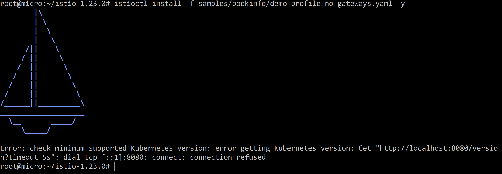

# Домашнее задание к занятию «Сетевое взаимодействие в K8S. Часть 2»

### Цель задания

В тестовой среде Kubernetes необходимо обеспечить доступ к двум приложениям снаружи кластера по разным путям.

------

### Чеклист готовности к домашнему заданию

1. Установленное k8s-решение (например, MicroK8S).
2. Установленный локальный kubectl.
3. Редактор YAML-файлов с подключённым Git-репозиторием.

------

### Инструменты и дополнительные материалы, которые пригодятся для выполнения задания

1. [Инструкция](https://microk8s.io/docs/getting-started) по установке MicroK8S.
2. [Описание](https://kubernetes.io/docs/concepts/services-networking/service/) Service.
3. [Описание](https://kubernetes.io/docs/concepts/services-networking/ingress/) Ingress.
4. [Описание](https://github.com/wbitt/Network-MultiTool) Multitool.

------

### Задание 1. Создать Deployment приложений backend и frontend

1. Создать Deployment приложения _frontend_ из образа nginx с количеством реплик 3 шт.

Создал:

```
apiVersion: apps/v1
kind: Deployment
metadata:
  name: frontend-deployment
  labels:
    app: front-nginx
spec:
  replicas: 3
  selector:
    matchLabels:
      app: front-nginx
  template:
    metadata:
      labels:
        app: front-nginx
    spec:
      containers:
      - name: nginx
        image: nginx:1.14.2
        ports:
        - containerPort: 80
```        

2. Создать Deployment приложения _backend_ из образа multitool. 

Создал:

```
apiVersion: apps/v1
kind: Deployment
metadata:
  name: backend-deployment
  labels:
    app: backend-multitool
spec:
  replicas: 1
  selector:
    matchLabels:
      app: backend-multitool
  template:
    metadata:
      labels:
        app: backend-multitool
    spec:
      containers:
      - name: multitool
        image: wbitt/network-multitool
        env:
        - name: HTTP_PORT
          value: "8080"
        - name: HTTPS_PORT
          value: "11443"
        ports:
        - containerPort: 8080
          name: http-port
        - containerPort: 11443
          name: https-port
```


3. Добавить Service, которые обеспечат доступ к обоим приложениям внутри кластера. 


```
apiVersion: v1
kind: Service
metadata:
  name: svc-frontend
spec:
  selector:
    app: front-nginx
  ports:
    - name: nginx
      protocol: TCP
      port: 9003
      targetPort: 80
```

```
apiVersion: v1
kind: Service
metadata:
  name: svc-backend
spec:
  selector:
    app: baclemd-multitool
  ports:
    - name: multitool
      protocol: TCP
      port: 9004
      targetPort: 8080
```


4. Продемонстрировать, что приложения видят друг друга с помощью Service.


Из мультитула проверяю через curl:


- к фронтенду подключилось, ок.

И к бэкенду:


5. Предоставить манифесты Deployment и Service в решении, а также скриншоты или вывод команды п.4.

Предоставил см. выше.

------

### Задание 2. Создать Ingress и обеспечить доступ к приложениям снаружи кластера

1. Включить Ingress-controller в MicroK8S.

Сначала пробую установить istio.

Устанавливаю istio по инструкции: https://istio.io/latest/docs/setup/getting-started/

Ставлю истио  на micro:

```
curl -L https://istio.io/downloadIstio | sh -
```


```
cd istio-1.23.0/
export PATH=$PWD/bin:$PATH
```

Пробую установить:

```
istioctl install -f samples/bookinfo/demo-profile-no-gateways.yaml -y
```
Но:




И действительно:


Тогда пойду по другому пути (в micro уже есть контроллер нужно только включить):

```
microk8s enable ingress
```


2. Создать Ingress, обеспечивающий доступ снаружи по IP-адресу кластера MicroK8S так, чтобы при запросе только по адресу открывался _frontend_ а при добавлении /api - _backend_.

```
apiVersion: networking.k8s.io/v1
kind: Ingress
metadata:
  name: my-ingress
spec:
  rules:
  - host: 51.250.12.101
    http:
      paths:
      - path: /
        backend:
          service:
            name: svc-frontend
            port:
              number: 9003
      - path: /api
        backend:
          service:
            name: svc-backend
            port:
              number: 9004
```
Получили ошибки:


Тогда создал свое DNS имя - запись и проверил:


Скорректировал код:

```
apiVersion: networking.k8s.io/v1
kind: Ingress
metadata:
  name: my-ingress
spec:
  rules:
  - host: ingress.dmil.ru
    http:
      paths:
      - path: /
        pathType: Prefix
        backend:
          service:
            name: svc-frontend
            port:
              number: 9003
      - path: /api
        pathType: Prefix
        backend:
          service:
            name: svc-backend
            port:
              number: 9004
```

Опять применяю уже успешно:


3. Продемонстрировать доступ с помощью браузера или `curl` с локального компьютера.

Работает доступ к frontend:


А вот с api не заработало:


При этмо сам сервис работает:


Еще попробовал поменять для пробы пути для frontend попробовал поставить /abc:

```
apiVersion: networking.k8s.io/v1
kind: Ingress
metadata:
  name: my-ingress
spec:
  rules:
  - host: ingress.dmil.ru
    http:
      paths:
      - path: /abc
        pathType: Prefix
        backend:
          service:
            name: svc-frontend
            port:
              number: 9003
      - path: /api
        pathType: Prefix
        backend:
          service:
            name: svc-backend
            port:
              number: 9004
```

Применил в кубере обновленную конфигурацию.

Но, в браузере abc не заработало:


Пробовал и перевыключать контроллер на микро:


- думал может конфигурация не обновилась.

и по пути / перестало работать - что логично т.к. я для пробы изменил на /abc:


Вот что выводит:


Теперь пробую / сделать для backend:

```
apiVersion: networking.k8s.io/v1
kind: Ingress
metadata:
  name: my-ingress
spec:
  rules:
  - host: ingress.dmil.ru
    http:
      paths:
      - path: /abc
        pathType: Prefix
        backend:
          service:
            name: svc-frontend
            port:
              number: 9003
      - path: /
        pathType: Prefix
        backend:
          service:
            name: svc-backend
            port:
              number: 9004
```


Теперь backend работает:


т.е. не работает именно path почему-то:


И еще раз возвращаю как надо:

```
apiVersion: networking.k8s.io/v1
kind: Ingress
metadata:
  name: my-ingress
spec:
  rules:
  - host: ingress.dmil.ru
    http:
      paths:
      - path: /
        pathType: Prefix
        backend:
          service:
            name: svc-frontend
            port:
              number: 9003
      - path: /api
        pathType: Prefix
        backend:
          service:
            name: svc-backend
            port:
              number: 9004
```


Опять по умолчанию без адреса работает:


а с /api не работает:


Почему?

4. Предоставить манифесты и скриншоты или вывод команды п.2.

------

### Правила приема работы

1. Домашняя работа оформляется в своем Git-репозитории в файле README.md. Выполненное домашнее задание пришлите ссылкой на .md-файл в вашем репозитории.
2. Файл README.md должен содержать скриншоты вывода необходимых команд `kubectl` и скриншоты результатов.
3. Репозиторий должен содержать тексты манифестов или ссылки на них в файле README.md.

------
